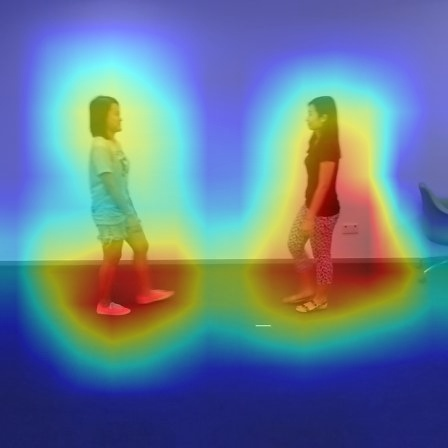
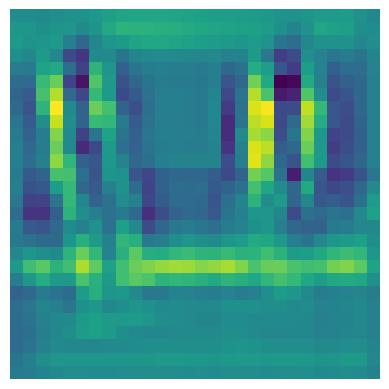
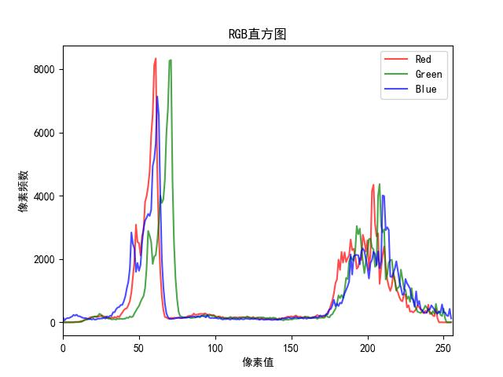
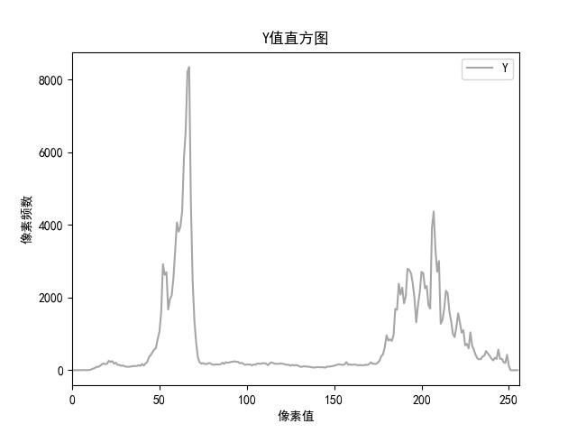

# visualization-utils
Some visualization tools for images and networks

------

本仓库提供一些图像和网络可视化工具，例如RGB直方图、Y值直方图、网络特征图和梯度热力图[Grad-Cam](https://github.com/jacobgil/pytorch-grad-cam)

## 梯度热力图Grad-Cam

|  |  |  |
| :----------------------------------------------------------: | :----------------------------------------------------------: | :----------------------------------------------------------: |

## 网络特征图

## 直方图

|                            RGB值                             |                             Y值                              |
| :----------------------------------------------------------: | :----------------------------------------------------------: |
|  |  |

------

## References

https://github.com/jacobgil/pytorch-grad-cam
